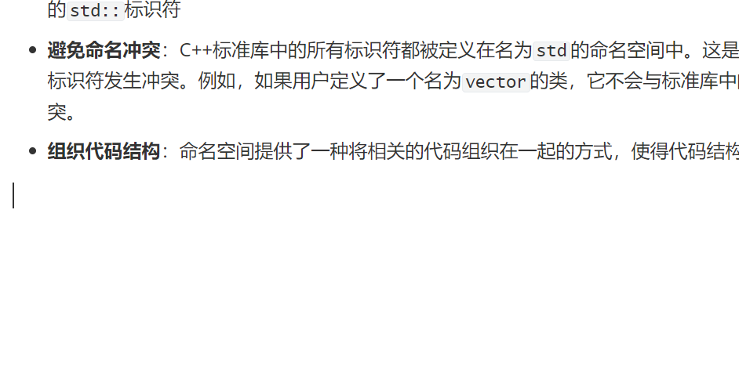

- **使用`using`声明**：可以使用`using`关键字来引入特定的标识符，使其在当前作用域中可见。例如，`using std::cout;`将`std::cout`引入当前作用域，之后就可以直接使用`cout`。
- **使用`using namespace`指令**：使用`using namespace std;`可以将整个`std`命名空间引入当前作用域，使得其中的所有标识符都可以直接使用。但这种方式可能会引入不必要的标识符，增加命名冲突的风险，因此在大型项目中不推荐使用。
- **直接指定**：在使用标准库中的函数或对象时，可以直接在其前面加上`std::`前缀。例如，`std::cout`用于标准输出，`std::cin`用于标准输入。
- 在使用`std::`时，需要确保包含了相应的标准库头文件。例如，使用`std::vector`需要包含`<vector>`头文件。
- 虽然`using namespace std;`可以简化代码，但在大型项目中可能会导致命名冲突，因此建议尽量使用具体的`std::`标识符
- **避免命名冲突**：C++标准库中的所有标识符都被定义在名为`std`的命名空间中。这是为了防止与用户自定义的标识符发生冲突。例如，如果用户定义了一个名为`vector`的类，它不会与标准库中的`std::vector`发生冲突。
- **组织代码结构**：命名空间提供了一种将相关的代码组织在一起的方式，使得代码结构更加清晰。

