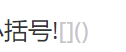
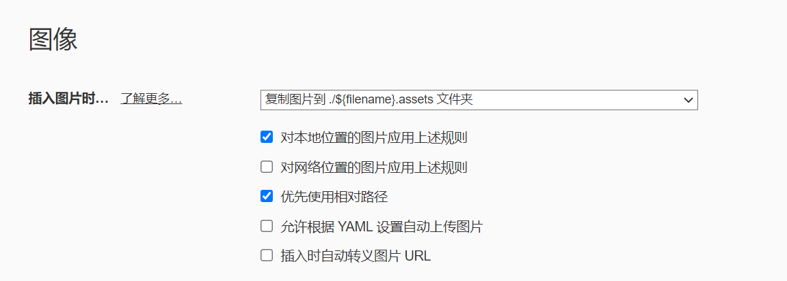
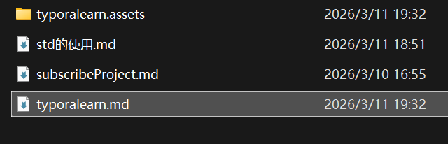
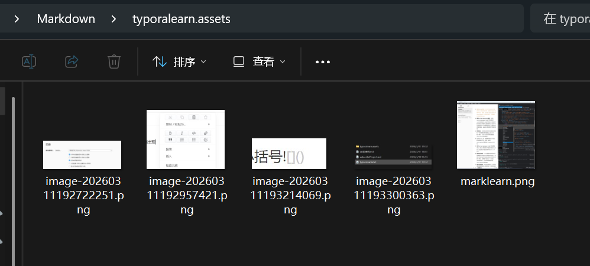
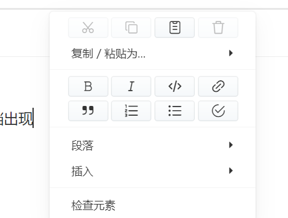
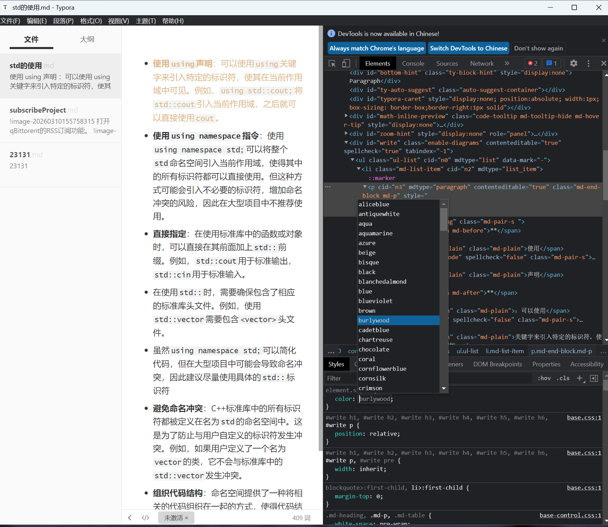

# typora 使用要点

## base operation

- 总结一下源代码模式的语句:

 1.高亮:  ==a==     （四个=  中）

2.标题: #文字 ##文字 ###文字 最多支持6级的标题(上述已经使用) 

3.加粗: **文字**  **a**(四个* 中)

 4.斜体: *文字* (两个*  中)

 5.上标: ^文字^ 

6.下标: ~文字~ 

7.列表: +文字 在+号前加两个空格可以实现下一级列表   ；

​			或者使用  *，-，+ 加一个 space。

​			嵌套（多级）序列使用 tab 缩进

+ 这是序列
  + 这是按下tab后的嵌套列表

8.表格: |文字|文字|文字| |---|---|---|---| |文字|文字|文字| 

9.引用: >文字 >>文字 >>>文字 打几个就可以实现几级的引用 

10.代码框: '文字 '  ''' 文字'''

11.符号: 使用 :one:   (  :    加上操作码英文  如前面的   冒号one  )

12. --- 三个 -  减号 加上enter 生成分割线

13. 插入图片 使用 感叹号+英文中括号+英文小括号

    

---

## md文档中的图片保存

在偏好设置中

后会自动保存

---

## 本质 

类浏览器

==偏好设置==中 打开 ==调试模式==，重启typora，右键md文档出现==检查元素==

可以使用CSS自定义风格样式

编写HTML

 

